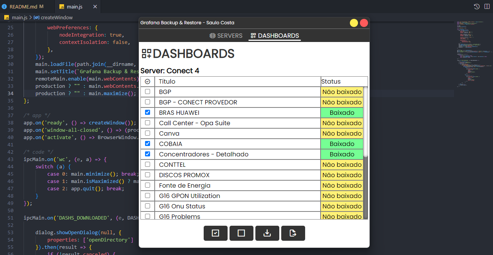

# Grafana - Dashboards (Backup & Restore)

Em construção 🏗️

> Fazer backup e restore das dashboards do grafana



## FIGMA

[Grafana Bakup &amp; Restore](https://www.figma.com/file/9AZDdvrRAdn1cvpTJYC87i/Grafana-Backup-%26-Restore?type=design&node-id=0%3A1&t=lcJXrPyAW99vR1ym-1)

## COMO USAR?

```bash
git clone https://github.com/saulotarsobc/grafana-bkp-electron.git
cd grafana-bkp-electron;
yarn install;
yarn start;

# para gerar um .exe na pasta 'dist'
yarn win;
```
